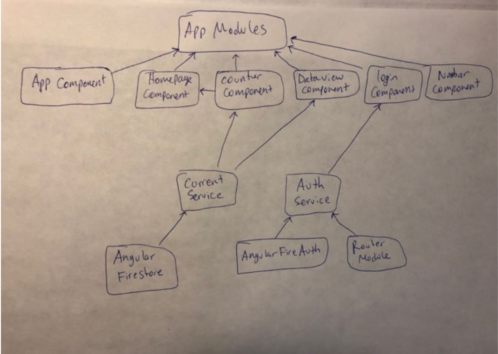
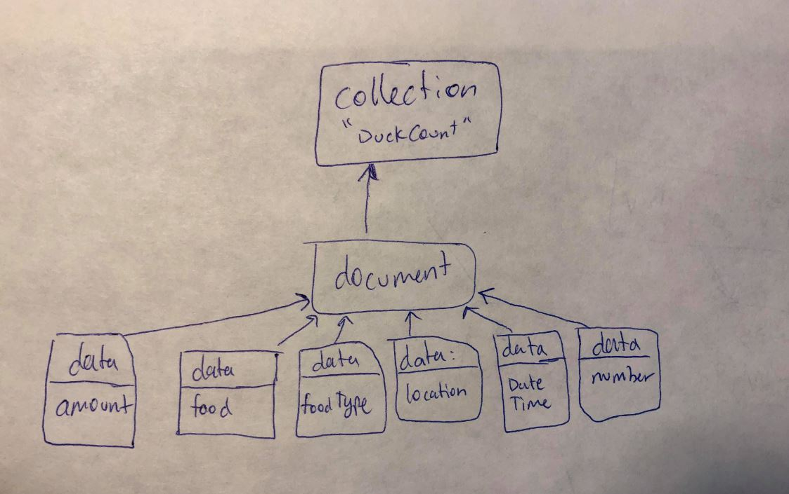

[Final Production](https://wzuaaxblx0.execute-api.eu-central-1.amazonaws.com/production/) (https://wzuaaxblx0.execute-api.eu-central-1.amazonaws.com/production/)

# Approach To Project:

The first thing I did was a reading of the entire assignment documentation, to get a high level understanding of the task at hand. For things I wasn't unsure about, I quickly emailed Meredith for some clarifying questions. 

Before coding, I briefly went over some basic design layout and some expected behaviour. Soon after, I started to implement the design. 

Implementation: 
-
* I broke the task down into parts: setting up the homepage with the forms, then an angular server that connects the form data to the firebase database, then a login component for 'the scientist' to login (connecting to firebase database), then finally retrieve and display the data in the database. At each step, I would also ensure that unit tests are passing, and used material css for styling.

* For the Homepage, I wanted to ensure a simple and intuitive UI/UX, so I made the landing page the form input right away, to reduce navigation time to the form. I then put some example placeholders for a user to understand what to input each field, and an automatic input of the date and time. To ensure data was collected properly, I disabled the submit button until each form field has value, and after the form was submitted, to prevent repetitive submissions. I also added a picture of a duck to make it more friendly, but unfortunately it isn't rendering properly in production. 

* For the Login and data view, I wanted a way to ensure only the 'scientist' was able to view the total data collection. So I set up firebase credentials in order to view the data after logging in with the right username/password. 

* As for the data view, I simply iterated through the list of form inputs made by users around the world and displayed it. For improvements, I could have also added a row that displays the total number for each field. 

* After implementating above, I deployed the app onto AWS. 

Set Backs:
- 
 There were some things I wasn't able to complete during the 10 hours I had to complete the assignment

-  The 'nice to have feature'. Unfortunately, I couldn't figure out a way to set a repeating schedule in an Angular App (as specified in the assignment). One of my ideas was to perhaps create a login for a user as well, and then click a 'start schedule' and 'stop schedule' option. I would've then retrieved the start and end dates/time and find the time difference between them and then multiply the form input values by that difference, to mimic a repeating schedule.

- Failing Tests: Again, due to the time constraint, I wasn't able to complete writing some tests and fixing some broken tests that occured along the way. Therefore I wasn't able to test some other features like firebase authentication, or firebase data input or retrieval, or Angular Routing. But I was able to fix a few of them and have the rest passing. 

- Production Build: Everything works when running the app locally, but the image is not rendering on production due to some AWS permissions that I wasn't able to figure out. 

 

# Technologies Chosen:

* I decided to use Angular for the front end application, Google's Firebase for the data base, and AWS for production. 

* I've had experience with Angular before so I thought it would be easiest for me to develop the HTLM/CSS pages, routing, and connection to the database in the shortest amount of time. I also wanted the application to be an SPA, to make the clicking of pages faster for a better UI experience. Additionally, I relied on Angular's pre-built protection against web attacks. As for the authentication, I relied on Angular's firebase authentication to retrieve data from the database.   

* I knew previously that Firebase was an easy-to-use database to set up with Angular, so I went with that option. 

* Also, since FreshWorks Studios uses AWS, I decided to use that for production as well, to get some hand on experience using it for a web application. 

# Component Diagram

# Database Diagram

## Overall 
I was able to complete a working version of the app with a few tests passing within the 10 hours, however, I spent about 2 more hours trying to fix the broken tests. After going overtime, I realized that this would've been the time to ask a colleague for help because I was having trouble getting some to work. So I spent about 12 hours from start to finish. Given more time, I would've fixed and added some tests, and fix the image rendering on the AWS production site. I might've also seperated the login and authentication into it's own modules. 

